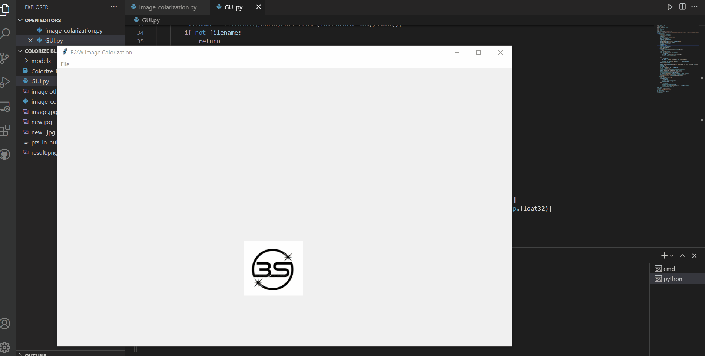
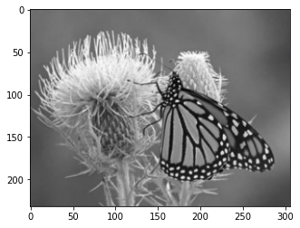
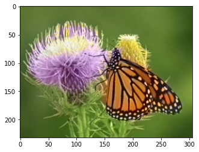

<div class="cell markdown" id="ONf1qRd1K7J7">

# Colorize Black white Image

This Deep Learning Project aims to provide colorizing black & white
images with Python.

In image colorization, we take a black and white image as input and
produce a colored image. We will solve this project with OpenCV deep
neural network.

</div>

<div class="cell markdown" id="pasjVk5WRXMM">



</div>

<div class="cell markdown" id="Tb-GeIj8Nl6Y">

### Lab Color Space:

Like RGB, Lab is another color space. It is also three channel color
space like RGB where the channels are:

    L channel: This channel represents the Lightness
    a channel: This channel represents green-red
    b channel: This channel represents blue-yellow

In this color space, the grayscale part of the image is only encoded in
L channel. Therefore Lab color space is more favorable for our project.

</div>

<div class="cell markdown" id="t25jOjTGNpQf">

### Problem Statement:

deep learning project colorize black white images with python

We can formulate our problem statement as to predict a and b channels,
given an input grayscale image.

In this deep learning project, we will use OpenCV DNN architecture which
is trained on ImageNet dataset. The neural net is trained with the L
channel of images as input data and a,b channels as target data.

</div>

<div class="cell markdown" id="JF04ygEWN1Dg">

#### Steps to implement Image Colorization Project:

For colorizing black and white images we will be using a pre-trained
caffe model, a prototxt file, and a NumPy file.

The prototxt file defines the network and the numpy file stores the
cluster center points in numpy format.

1.  Make a directory with name models.

</div>

<div class="cell code" data-execution_count="1" id="iyWZYzh65gX2">

``` python
!mkdir models
```

</div>

<div class="cell markdown" id="aTQIFk1MN8-U">

download the caffemodel, prototxt file and the NumPy file.

</div>

<div class="cell code" data-execution_count="3" data-colab="{&quot;base_uri&quot;:&quot;https://localhost:8080/&quot;}" id="lE0XfKuP5kZd" data-outputId="4d70b345-f785-43b1-9d29-88f4c482f8ed">

``` python
!wget https://github.com/richzhang/colorization/blob/caffe/colorization/resources/pts_in_hull.npy?raw=true -O ./pts_in_hull.npy
```

</div>

<div class="cell code" data-execution_count="4" data-colab="{&quot;base_uri&quot;:&quot;https://localhost:8080/&quot;}" id="fLpvCltE5u72" data-outputId="567f403e-e26c-4bfd-9c06-c938b5ba4743">

``` python
!wget https://raw.githubusercontent.com/richzhang/colorization/caffe/colorization/models/colorization_deploy_v2.prototxt -O ./models/colorization_deploy_v2.prototxt
```


</div>

<div class="cell code" data-execution_count="5" data-colab="{&quot;base_uri&quot;:&quot;https://localhost:8080/&quot;}" id="OmIJf0BI7acl" data-outputId="ad130ef0-f3bf-4730-c9af-415d9831c25f">

``` python
!wget http://eecs.berkeley.edu/~rich.zhang/projects/2016_colorization/files/demo_v2/colorization_release_v2.caffemodel -O ./models/colorization_release_v2.caffemodel
```

</div>

<div class="cell markdown" id="hu-I5bAeOCHp">

### Import Essential Library

</div>

<div class="cell code" data-execution_count="12" id="RUWZq8Sq7g4m">

``` python
import numpy as np
import cv2 as cv
from matplotlib import pyplot as plt
import os.path
```

</div>

<div class="cell markdown" id="lwURjJ_IOFyk">

### Read B\&W image and load the caffemodel:

</div>

<div class="cell code" data-execution_count="14" data-colab="{&quot;height&quot;:269,&quot;base_uri&quot;:&quot;https://localhost:8080/&quot;}" id="qm-fStTe7ybo" data-outputId="a2542c6b-f748-4ad1-9313-149c8b3cf28c">

``` python
frame = cv.imread("new.jpg")

numpy_file = np.load('./pts_in_hull.npy')
Caffe_net = cv.dnn.readNetFromCaffe("./models/colorization_deploy_v2.prototxt", "./models/colorization_release_v2.caffemodel")


rgb_img = cv.cvtColor(frame, cv.COLOR_BGR2RGB)		# this converts it into RGB
plt.imshow(rgb_img)
plt.show()
```

<div class="output display_data">



</div>

</div>

<div class="cell markdown" id="qgVEsYfxONnb">

### Add layers to the caffe model:

</div>

<div class="cell code" data-execution_count="9" id="f-UAR2AS72yi">

``` python
numpy_file = numpy_file.transpose().reshape(2, 313, 1, 1)
Caffe_net.getLayer(Caffe_net.getLayerId('class8_ab')).blobs = [numpy_file.astype(np.float32)]
Caffe_net.getLayer(Caffe_net.getLayerId('conv8_313_rh')).blobs = [np.full([1, 313], 2.606, np.float32)]
```

</div>

<div class="cell markdown" id="jxty2X4BORrv">

### Extract L channel and resize it:

</div>

<div class="cell code" data-execution_count="10" id="r4UdVyYx8l8N">

``` python
input_width = 224
input_height = 224

rgb_img = (frame[:,:,[2, 1, 0]] * 1.0 / 255).astype(np.float32)
lab_img = cv.cvtColor(rgb_img, cv.COLOR_RGB2Lab)
l_channel = lab_img[:,:,0] 

l_channel_resize = cv.resize(l_channel, (input_width, input_height)) 
l_channel_resize -= 50
```

</div>

<div class="cell markdown" id="KhrO4zrIOWPA">

### Predict the ab channel and save the result:

</div>

<div class="cell code" data-execution_count="11" data-colab="{&quot;base_uri&quot;:&quot;https://localhost:8080/&quot;}" id="Quh9YGtL8oR5" data-outputId="450a4077-e0cb-4f13-e308-68977d7073e9">

``` python
Caffe_net.setInput(cv.dnn.blobFromImage(l_channel_resize))
ab_channel = Caffe_net.forward()[0,:,:,:].transpose((1,2,0)) 

(original_height,original_width) = rgb_img.shape[:2] 
ab_channel_us = cv.resize(ab_channel, (original_width, original_height))
lab_output = np.concatenate((l_channel[:,:,np.newaxis],ab_channel_us),axis=2) 
bgr_output = np.clip(cv.cvtColor(lab_output, cv.COLOR_Lab2BGR), 0, 1)

cv.imwrite("./result.png", (bgr_output*255).astype(np.uint8))
```

<div class="output execute_result" data-execution_count="11">

    True

</div>

</div>

<div class="cell markdown" id="QP2B9ifWOY_o">

### Output

</div>

<div class="cell code" data-execution_count="15" data-colab="{&quot;height&quot;:269,&quot;base_uri&quot;:&quot;https://localhost:8080/&quot;}" id="l59rGCbJ8sk3" data-outputId="ae2952af-376b-40d3-e49d-832853706fb2">

``` python
frame1 = cv.imread("result.png")
rgb_img = cv.cvtColor(frame1, cv.COLOR_BGR2RGB)		# this converts it into RGB
plt.imshow(rgb_img)
plt.show()
```

<div class="output display_data">



</div>

</div>

<div class="cell markdown" id="deB9kvi3OgAI">

## Code for GUI:

</div>

<div class="cell code" data-execution_count="22" data-colab="{&quot;base_uri&quot;:&quot;https://localhost:8080/&quot;}" id="d4IxXTo-Akzj" data-outputId="f4d92e86-eab0-4066-e157-4ec730618d5d">

``` python
%%writefile gui.py

import tkinter as tk
from tkinter import *
from tkinter import filedialog
from PIL import Image, ImageTk
import os
import numpy as np
import cv2 as cv
import os.path
import matplotlib
matplotlib.use('Agg')

import sys
import os

if os.environ.get('DISPLAY','') == '':
    print('no display found. Using :0.0')
    os.environ.__setitem__('DISPLAY', ':0.0')
    
numpy_file = np.load('./pts_in_hull.npy')
Caffe_net = cv.dnn.readNetFromCaffe("./models/colorization_deploy_v2.prototxt", "./models/colorization_release_v2.caffemodel")
numpy_file = numpy_file.transpose().reshape(2, 313, 1, 1)

class Window(Frame):
    def __init__(self, master=None):
        Frame.__init__(self, master)

        self.master = master
        self.pos = []
        self.master.title("B&W Image Colorization")
        self.pack(fill=BOTH, expand=1)

        menu = Menu(self.master)
        self.master.config(menu=menu)

        file = Menu(menu)
        file.add_command(label="Upload Image", command=self.uploadImage)
        file.add_command(label="Color Image", command=self.color)
        menu.add_cascade(label="File", menu=file)

        self.canvas = tk.Canvas(self)
        self.canvas.pack(fill=tk.BOTH, expand=True)
        self.image = None
        self.image2 = None

        label1=Label(self,image=img)
        label1.image=img
        label1.place(x=400,y=370)


    def uploadImage(self):
        filename = filedialog.askopenfilename(initialdir=os.getcwd())
        if not filename:
            return
        load = Image.open(filename)

        load = load.resize((480, 360), Image.ANTIALIAS)

        if self.image is None:
            w, h = load.size
            width, height = root.winfo_width(), root.winfo_height()
            self.render = ImageTk.PhotoImage(load)
            self.image = self.canvas.create_image((w / 2, h / 2), image=self.render)
           
        else:
            self.canvas.delete(self.image3)
            w, h = load.size
            width, height = root.winfo_screenmmwidth(), root.winfo_screenheight()
           
            self.render2 = ImageTk.PhotoImage(load)
            self.image2 = self.canvas.create_image((w / 2, h / 2), image=self.render2)


        frame = cv.imread(filename)
    
        Caffe_net.getLayer(Caffe_net.getLayerId('class8_ab')).blobs = [numpy_file.astype(np.float32)]
        Caffe_net.getLayer(Caffe_net.getLayerId('conv8_313_rh')).blobs = [np.full([1, 313], 2.606, np.float32)]

        input_width = 224
        input_height = 224

        rgb_img = (frame[:,:,[2, 1, 0]] * 1.0 / 255).astype(np.float32)
        lab_img = cv.cvtColor(rgb_img, cv.COLOR_RGB2Lab)
        l_channel = lab_img[:,:,0] 

        l_channel_resize = cv.resize(l_channel, (input_width, input_height)) 
        l_channel_resize -= 50 

        Caffe_net.setInput(cv.dnn.blobFromImage(l_channel_resize))
        ab_channel = Caffe_net.forward()[0,:,:,:].transpose((1,2,0)) 

        (original_height,original_width) = rgb_img.shape[:2] 
        ab_channel_us = cv.resize(ab_channel, (original_width, original_height))
        lab_output = np.concatenate((l_channel[:,:,np.newaxis],ab_channel_us),axis=2) 
        bgr_output = np.clip(cv.cvtColor(lab_output, cv.COLOR_Lab2BGR), 0, 1)

  
        cv.imwrite("./result.png", (bgr_output*255).astype(np.uint8))

    def color(self):

        load = Image.open("./result.png")
        load = load.resize((480, 360), Image.ANTIALIAS)

        if self.image is None:
            w, h = load.size
            self.render = ImageTk.PhotoImage(load)
            self.image = self.canvas.create_image((w / 2, h/2), image=self.render)
            root.geometry("%dx%d" % (w, h))
        else:
            w, h = load.size
            width, height = root.winfo_screenmmwidth(), root.winfo_screenheight()

            self.render3 = ImageTk.PhotoImage(load)
            self.image3 = self.canvas.create_image((w / 2, h / 2), image=self.render3)
            self.canvas.move(self.image3, 500, 0)
 

root = tk.Tk()
root.geometry("%dx%d" % (980, 600))
root.title("B&W Image Colorization GUI")
img = ImageTk.PhotoImage(Image.open("logo2.png"))

app = Window(root)
app.pack(fill=tk.BOTH, expand=1)
root.mainloop()
```

<div class="output stream stdout">

    Overwriting gui.py

</div>

</div>

<div class="cell markdown" id="siqSAr_aOrf0">

## Summary:

This Notebook build a deep learning project to colorize black and white
images. It first introduces us to Lab color space and why it is
favorable for our problem statement. Then step by step it describes how
to implement black and white image colorizer.

</div>
