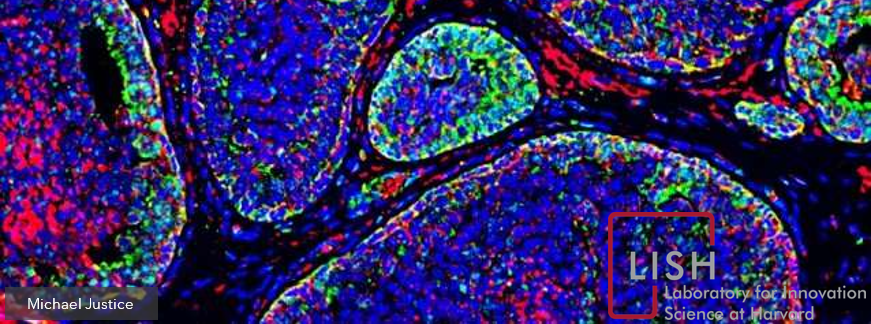

<div class="cell markdown">

# Mechanisms of Action (MoA) Prediction

Helping to develop an algorithm to predict a compound’s MoA given its
cellular signature, and thus, helping scientists advance the drug
discovery process. \[paraphrased\]



**The Goal**: "Develop an algorithm that automatically labels each case
(in this case, sig\_id) in the test set as one or more MoA classes. Note
that since drugs can have multiple MoA annotations, the task is formally
a multi-label classification problem."

In other words, the goal is to develop a machine learning algorithm that
can correctly (or try to, within some error) classify which drug (or
drugs) was inhibitated, based on biological activity. In this scenario,
biological activity is defined as gene expressions and cell viability of
a sample of 100 cells. Since I did not know what a gene expression or
cell viability was at first, I researched. Here's what I found.

1.  A gene is a special strand of DNA within a cell. This gene contains,
    like all other parts of the DNA, a collection of nucleotides.
    However, the nucleotides within this special strand of DNA (the
    gene) are in a certain sequence, and this sequence is like a recipe
    to building proteins for certain functions within the body. It's the
    sequence of the nucleotides (As, Cs, Ts and Gs) that make a strand
    of DNA special - and that's a gene\!

2.  Gene expression is simply the activation of RNA transferring DNA
    (the gene) to the ribosomes in the cell to do protein synthesis. In
    other words, think of the gene as a lightbulb. Now, think of the
    'expression' as the light swtich. When the lightbulb is turned on
    (i.e. when the gene is 'expressed'), that's the DNA telling the RNA
    to begin the journey to protein production. So, we can think of gene
    expression as what controls the gene's protein production. Note: the
    type of protein produced can be manipulated based on internal or
    external factors of the body.

3.  Cell Viability is the measurement of healthy, live cells in a
    population. Though I am not sure how they are measuring cell
    viability, I do know the values range from -10 to 6.412.

</div>

<div class="cell markdown">

**Subjects** - that's denoted as sig\_id. Harvard collected 100 cell
samples from a bunch of subjects (actually, 23,814 subjects to be exact)
and mapped those subjects to multiple MoA (Mechanism of Action)
responses. These responses are our target values, meaning they are what
we will be predicting. There are a total of 206 unique responses.

**Pertubation Sample Type** - that's denoted as cp\_type. It's
categorical, with only two values - trt\_cp (compound pertubation), and
ctl\_vehicle (control pertubation). Note that ctl\_vehicle has no MoA
responses.

**Treatment Duration** - that's denoted as cp\_time. It's categorical,
with only three values - 24, 48, 72

**Treatmennt Dose** - that's denoted as cp\_dose. It's categorical, with
only two values - D1 (or high doseage) and D2 (low dosage).

**Gene Expression** - these features are denoted as g- in the data set.
It goes from g-0 all the way to g-771.

**Cell Viability** - these features are denoted as c- in the data set.
It goes from c-0 all the way to c-99.

</div>

<div class="cell code" data-execution_count="1">

``` python
import pandas as pd
import numpy as np
import seaborn as sns
import matplotlib.pylab as plt
from matplotlib.pylab import rcParams
rcParams['figure.figsize'] = 20, 4
sns.set_style("darkgrid")
```

</div>

<div class="cell code" data-execution_count="2">

``` python
# for the sampling
from imblearn.over_sampling import RandomOverSampler, SMOTE, ADASYN
from imblearn.under_sampling import RandomUnderSampler
from imblearn.pipeline import Pipeline

# for the linear models that need scaled input data
from sklearn.preprocessing import MinMaxScaler, StandardScaler

# for general modeling
from sklearn import model_selection, pipeline, ensemble, metrics, linear_model, svm, neighbors
from sklearn.dummy import DummyClassifier

# for lda
from sklearn.discriminant_analysis import LinearDiscriminantAnalysis

# for tracking how long things take
import time
```

</div>

<div class="cell code" data-execution_count="3">

``` python
X = pd.read_csv('train_features.csv')
test = pd.read_csv('test_features.csv')
y = pd.read_csv('train_targets_scored.csv')
#y_notscored = pd.read_csv('train_ys_nonscored.csv')
#sample_submission = pd.read_csv('sample_submission.csv')
y.drop('sig_id',axis=1,inplace=True)
```

</div>

<div class="cell code" data-execution_count="4">

``` python
print("Null values present in X: {}".format(X.isnull().any().any()))
print("Null values present in X: {}".format(test.isnull().any().any()))
```

<div class="output stream stdout">

    Null values present in X: False
    Null values present in X: False

</div>

</div>

<div class="cell markdown">

Plot of Cell Viability (first 10 of 100 cell samples - all subjects)

</div>

<div class="cell code" data-execution_count="6">

``` python
call_viability_columns = list(X.columns[X.columns.str.contains('c-')])
```

</div>

<div class="cell code" data-execution_count="7">

``` python
cell_data = X[call_viability_columns]
```

</div>

<div class="cell code" data-execution_count="8">

``` python
cell_data.info(verbose=False)
```

<div class="output stream stdout">

    <class 'pandas.core.frame.DataFrame'>
    RangeIndex: 23814 entries, 0 to 23813
    Columns: 100 entries, c-0 to c-99
    dtypes: float64(100)
    memory usage: 18.2 MB

</div>

</div>

<div class="cell code" data-execution_count="9">

``` python
print("Min Cell Viability value: {}".format(cell_data.min().min()))
print("Max Cell Viability value: {}".format(cell_data.max().max()))
```

<div class="output stream stdout">

    Min Cell Viability value: -10.0
    Max Cell Viability value: 6.412

</div>

</div>

<div class="cell code" data-execution_count="12">

``` python
sns.boxplot(x='variable', y='value', data=pd.melt(cell_data.iloc[:,:10]))
```

<div class="output execute_result" data-execution_count="12">

    <matplotlib.axes._subplots.AxesSubplot at 0x21dab317af0>

</div>

<div class="output display_data">


</div>

</div>

<div class="cell markdown">

The cell viability all looks pretty normally distributed. We can tell by
the box of the box-plot - its got the mean line (the horizontal line
inside the box) pretty much in the box's center. Let's plot a histrogram
of all the cells and see if the underlying distribution of cell
viability is normally distributed.

</div>

<div class="cell code" data-execution_count="125">

``` python
sns.distplot(cell_data.iloc[:,:], kde=False)
```

<div class="output execute_result" data-execution_count="125">

    <matplotlib.axes._subplots.AxesSubplot at 0x28ff9b0b1c0>

</div>

<div class="output display_data">


</div>

</div>

<div class="cell code" data-execution_count="131">

``` python
# Those outliers! Let's double check.
((cell_data>=-10) & (cell_data<-9)).sum().sum()
```

<div class="output execute_result" data-execution_count="131">

    46880

</div>

</div>

<div class="cell markdown">

Pretty normally distributed. We should note that we get about 40,000
cell samples that have a cell viability value of near -9.0 to -10.0.
Those seem like severe outliers, and occur for probably every cell
measured for all subjects. At least, this is what the box plot would
indicate above.

Next, let's plot a histogram of the *means* of the cell viability data.
We know this will appear normal because of the central limit theorem.

Since we have 100 cells for each subject, we'll calculate the mean value
of all the cell viability values for each subject and plot that
histogram.

</div>

<div class="cell code" data-execution_count="147">

``` python
sns.distplot(cell_data.mean(axis=1), kde=True)
```

<div class="output execute_result" data-execution_count="147">

    <matplotlib.axes._subplots.AxesSubplot at 0x28f8bfe4e20>

</div>

<div class="output display_data">


</div>

</div>

<div class="cell code" data-execution_count="166">

``` python
print("Mean of our Cell Viability data: {}".format(cell_data.mean(axis=1).mean()))
print("Standard Deviation of our Cell Viability data: {}".format(cell_data.mean(axis=1).std()))
```

<div class="output stream stdout">

    Mean of our Cell Viability data: -0.43223128483244994
    Standard Deviation of our Cell Viability data: 1.7320862869924816

</div>

</div>

<div class="cell markdown">

Gene expression plots

</div>

<div class="cell code" data-execution_count="6">

``` python
gene_columns = list(X.columns[X.columns.str.contains('g-')])
```

</div>

<div class="cell code" data-execution_count="78">

``` python
gene_data = X[gene_columns]
```

</div>

<div class="cell code" data-execution_count="79">

``` python
gene_data.info()
```

<div class="output stream stdout">

    <class 'pandas.core.frame.DataFrame'>
    RangeIndex: 23814 entries, 0 to 23813
    Columns: 772 entries, g-0 to g-771
    dtypes: float64(772)
    memory usage: 140.3 MB

</div>

</div>

<div class="cell code" data-execution_count="157">

``` python
print("Min Gene Expression value: {}".format(gene_data.min().min()))
print("Max Gene Expression value: {}".format(gene_data.max().max()))
```

<div class="output stream stdout">

    Min Gene Expression value: -10.0
    Max Gene Expression value: 10.0

</div>

</div>

<div class="cell code" data-execution_count="108">

``` python
sns.boxplot(x='variable', y='value', data=pd.melt(gene_data.iloc[:,10:20]))
```

<div class="output execute_result" data-execution_count="108">

    <matplotlib.axes._subplots.AxesSubplot at 0x28f8a6204f0>

</div>

<div class="output display_data">


</div>

</div>

<div class="cell markdown">

Similar to cell viability, gene expression also appears to be normally
distributed. Let's plot a histogram of all the data points (like we did
for cell viability).

</div>

<div class="cell code" data-execution_count="132">

``` python
sns.distplot(gene_data.iloc[:,:], kde=False)
```

<div class="output execute_result" data-execution_count="132">

    <matplotlib.axes._subplots.AxesSubplot at 0x28f8b0e7ee0>

</div>

<div class="output display_data">


</div>

</div>

<div class="cell markdown">

Again, like we saw before with cell viability, the gene expression data
appears to be normally distributed. We do not have any stark outliers
like we did in the cell viability data.

Next, let's plot a histogram of the *means* of the gene expression data.
We know this will appear normal because of the central limit theorem.

We have 206 different gene expressions for each subject, so we'll
calculate the mean value of all the gene expressions for each subject
and plot that histogram.

</div>

<div class="cell code" data-execution_count="162">

``` python
sns.distplot(gene_data.mean(axis=1), kde=True)
```

<div class="output execute_result" data-execution_count="162">

    <matplotlib.axes._subplots.AxesSubplot at 0x28f8ccb8250>

</div>

<div class="output display_data">


</div>

</div>

<div class="cell code" data-execution_count="165">

``` python
print("Mean of our Gene Expression data: {}".format(gene_data.mean(axis=1).mean()))
print("Standard Deviation of our Gene Expression data: {}".format(gene_data.mean(axis=1).std()))
```

<div class="output stream stdout">

    Mean of our Gene Expression data: 0.009009573150247764
    Standard Deviation of our Gene Expression data: 0.04866617246751549

</div>

</div>

<div class="cell markdown">

### Compound Data (Pertubation Type, Treatment time and Dosage)

</div>

<div class="cell code" data-execution_count="4">

``` python
compound_columns = ['cp_type', 'cp_time', 'cp_dose']
```

</div>

<div class="cell code" data-execution_count="5">

``` python
X_compound_data = X[compound_columns]
```

</div>

<div class="cell code" data-execution_count="7">

``` python
X_compound_data.info()
```

<div class="output stream stdout">

    <class 'pandas.core.frame.DataFrame'>
    RangeIndex: 23814 entries, 0 to 23813
    Data columns (total 3 columns):
     #   Column   Non-Null Count  Dtype 
    ---  ------   --------------  ----- 
     0   cp_type  23814 non-null  object
     1   cp_time  23814 non-null  int64 
     2   cp_dose  23814 non-null  object
    dtypes: int64(1), object(2)
    memory usage: 558.3+ KB

</div>

</div>

<div class="cell code" data-execution_count="12">

``` python
X_compound_data.apply(pd.Series.value_counts)
```

<div class="output execute_result" data-execution_count="12">

``` 
             cp_type  cp_time  cp_dose
24               NaN   7772.0      NaN
48               NaN   8250.0      NaN
72               NaN   7792.0      NaN
D1               NaN      NaN  12147.0
D2               NaN      NaN  11667.0
ctl_vehicle   1866.0      NaN      NaN
trt_cp       21948.0      NaN      NaN
```

</div>

</div>

<div class="cell markdown">

From what we can see above, all our compound data is categorical. In
other words, these data are not continuous.

</div>

<div class="cell code" data-execution_count="145">

``` python
sns.violinplot(x="cp_dose", y="cp_time", hue="cp_type",data=X_compound_data, palette='Set2',inner="quartile")
```

<div class="output execute_result" data-execution_count="145">

    <matplotlib.axes._subplots.AxesSubplot at 0x10a00679790>

</div>

<div class="output display_data">


</div>

</div>

<div class="cell markdown">

And from what we can see from the violin plot, the distributions of the
compound attributes compared to each other are pretty even\! In other
words, all three of the compound attributes are shared almost
uniformally - for example, there isn't a treatment time that *only*
applied to a certain doseage or compound type.

However, we must note here that there is overall more data for trt\_cp
than the ctl\_vehicle. That's because ctl\_vehicle is the control
pertubation, meaning subjects that got that pertubation did not receive
a drug inhibition. We have less of these control pertubations than
actual compound pertubations, because we care more about the cells that
actually underwent gene expression changes due to drug inhibition.

Let's one-hot encode all the data so we can prep it for modeling.

</div>

<div class="cell code" data-execution_count="6">

``` python
from sklearn.preprocessing import OneHotEncoder, LabelEncoder
```

</div>

<div class="cell code" data-execution_count="7">

``` python
encoder = OneHotEncoder(sparse=False)
```

</div>

<div class="cell code" data-execution_count="8">

``` python
# and also transform the test data
X_compound_data_encoded = pd.DataFrame(encoder.fit_transform(X_compound_data))
X_compound_data_encoded.columns = encoder.get_feature_names()
```

</div>

<div class="cell code" data-execution_count="9">

``` python
X_encoded = pd.concat([X.drop(compound_columns,axis=1), X_compound_data_encoded ], axis=1)
```

</div>

<div class="cell code" data-execution_count="10">

``` python
# and also transform the test data
test_compound_data = test[compound_columns]
test_compound_data_encoded = pd.DataFrame(encoder.transform(test_compound_data))
test_compound_data_encoded.columns = encoder.get_feature_names()
```

</div>

<div class="cell code" data-execution_count="11">

``` python
test_encoded = pd.concat([test.drop(compound_columns,axis=1), test_compound_data_encoded ], axis=1)
```

</div>

<div class="cell markdown">

### Target Data

</div>

<div class="cell code" data-execution_count="14">

``` python
y.shape
```

<div class="output execute_result" data-execution_count="14">

    (23814, 206)

</div>

</div>

<div class="cell markdown">

We've got 206 different drugs inhibited, spread across almost 24,000
subjects. The question is in the distribution of these classes.

</div>

<div class="cell code" data-execution_count="44">

``` python
num_pos_classes = (y==1).sum().sum()
num_neg_classes = (y==0).sum().sum()
print("Only {:.2f}% of all the target values belong to the positive class.".format((num_pos_classes/(num_neg_classes+num_pos_classes))*100))
```

<div class="output stream stdout">

    Only 0.34% of all the target values belong to the positive class.

</div>

</div>

<div class="cell markdown">

The above tells us that less than 0.5% of all the possible target values
actually belong to the positive class. In other words, our target data
is very sparse (lots of zeros). In machine learning, this presents a
challenge in both how we model the data (i.e. which algorithm and/or
methodology to use), and how we tune the parameters of the model.

</div>

<div class="cell markdown">

### Class Imbalance

In any machine learning problem, we're trying to use data to make
predictions. But sometimes the training data we have, specifically the
target labels (or in this case, drugs) are imbalanced. What we mean by
imbalanced is that we have way more of a negative class (or '0', as it
should be labeled) than we do the positive class (or '1'). Class
imbalance happens pretty frequently, and thus it's important to know how
treat it.

#### A Note on Accuracy

Accuracy, when used as the scoring method for class-imbalanced datasets,
can be misleading.

Assume we measured 100 drug-inhibited subjects, got all their cell
viabilities and gene expression data, and then mapped those data to the
drug. But what if one of the drugs inhibited was costly, and we didn't
have enough of that drug to give to a lot of our subjects? Assume only 2
of the 100 subjects got the costly drug. Now, imagine we wanted to train
a classifier to predict the costly drug based on the cell/gene data. In
this case, our model would look awesome - it'd be 98% accurate\! The
model would just predict the negative class (i.e. the subject was not
inhibited the costly drug, or '0') all the time.

Is this what we need? It depends. This model would be 100% correct for
all the negative classes (our true negative rate would be perfect, 1.0),
but it would have 0% accuracy in terms of the positive class (a true
postive rate, or sensitivity/recall would be 0). If failing to predict
the positive class everytime is costly or even dangerous, then we'd
consider the metric accuracy, in this case, to be misleading in terms of
the performance of our model. We need to prioritize our true positive
rate (the % of samples we correctly classify as having a drug
inhibited).

#### Approaches

In this dataset, we have two approaches to the data.

##### 1\. Assume there is *mutual exclusivity* amongst the different drugs inhibited to the subject.

This means that we're assuming there is no correlation between multiple
drugs when inhibited to a single subject. In machine learning, we'll
approach this type of problem where we train an individual classifier
for each drug. However, class imbalance may lead to severe overfitting
and high variability in our validation sets due to the sparse nature of
the dataset.

Let's calculate what the imbalance would be for each of the drugs, and
check it against a threshold to get a general idea.

</div>

<div class="cell code" data-execution_count="49">

``` python
moa_class_ratios = (y.T.sum(axis=1)/y.shape[0]).rename('% of positive class')
```

</div>

<div class="cell code" data-execution_count="54">

``` python
plt.hist(moa_class_ratios)
plt.title('Class Ratios (for each drug type)')
plt.ylabel('Drug Count')
plt.show()
```

<div class="output display_data">


</div>

</div>

<div class="cell markdown">

Wow\! All the drugs in this dataset have a class imbalance (of the
positive class) of at most 3.5% **when looked at individually**. In
other words, if we only had one drug, Drug A, and we collected 1,000
subjects's cell and gene expression data, we wouldn't have more than 35
individual subjects mapped to Drug A (or 965 subjects without it). We'll
look at the pitfalls of this approach when we do a deep dive later.

</div>

<div class="cell markdown">

##### 2\. Assume there is some *mutual inclusivity* amongst the different drugs inhibited to the subjects.

This means that if there is some correlation between multiple drugs
inhibited to a single subject, we'll pick up on that. This is different
than the first approach because instead of training individual
classifiers for each drug, we'll train one complete classifier for all
the drugs.

Let's look at the number of subjects who actually had a drug inhibition
mapped to them. We'll count the number of drugs they were mapped
towards, and plot that distribution below.

</div>

<div class="cell code" data-execution_count="47">

``` python
mlbl_count_data = y.sum(axis=1).value_counts()
```

</div>

<div class="cell code" data-execution_count="24">

``` python
sns.barplot(x=mlbl_count_data.index, y=mlbl_count_data.values/y.shape[0], palette='Set2')
plt.ylabel('% of Samples', fontsize=12)
plt.xlabel('# of multi-labels', fontsize=12)
```

<div class="output execute_result" data-execution_count="24">

    Text(0.5, 0, '# of multi-labels')

</div>

<div class="output display_data">


</div>

</div>

<div class="cell markdown">

The above tells you that no more than 7 drugs were inhibited for a
single subject. The majority of subjects (about 53%) had only one drug
inhibited, and nearly 40% of the subjects didn't have any drugs
associated to them\! In other words, these subjects were administered
either the control pertubation (and not the compound) or their gene
expressions did not match any MoAs from the database.

We can summarize this neatly by saying:

1.  39% of the subjects did not have any drugs assocaited (negative
    label)
2.  53% of the subjects had one drug associated (positive label)
3.  And the remaining subjects (8%) had multiple drugs associated
    (positive label)

</div>

<div class="cell markdown">

We should note that the standard ROC-AUC metric, which is the area under
the curve of the True Positive Rate (TPR) and False Positive Rate (FPR),
would be misleading for a dataset such as this one. Like accuracy, our
ROC-AUC score would be misleading as FPR (the x-axis of the curve)
contains information relating to the majority class. We want a metric
that focuses solely on the minority class for any of these two reasons:

1.  We care more about getting the positive classes correctly predictive
    (in other words, the True Positive Rate, or 'recall').
2.  Our binary classification labels are heavily skewed.

Thus, we'll throw out the FPR and replace it with something called
precision. Precision focuses on the minority class. Here's some helpful
definitions: \\begin{equation*} True Positive Rate (TPR) = Recall =
\\frac{TP}{(TP+FN)} \\end{equation*} \\begin{equation*} False Positive
Rate (FPR) = \\frac{FP}{(FP+TN)} \\end{equation*} \\begin{equation*}
Precision = \\frac{TP}{(TP+FP)} \\end{equation*}

We'll use the Precision-Recall area under the curve (pr-auc) metric to
evaluate the skillfullness of our model, and compare this single value
to other models.

</div>

<div class="cell markdown">

## Model

</div>

<div class="cell markdown">

The interesting thing about this dataset is that it's multi-label.
Meaning, we've got multiple subjects that were inhibited to one or more
combinations of drugs. In order to get probabilities for each drug, we
have a few options based on the approaches we talked about above.

Approach\#1

    [OnevsRest] - transform this multi-label problem into multiple single-label problems. In other words, train a classifier on the dataset for each of the 206 drugs seperately. The problem here is that we assume mutually *exclusivity* of the labels. If the labels are strongly correlated, then we can probably expect this method to do worse than a method that takes all the labels into account. As we saw before, the classes are very imbalanced (<=3.5% for the positive class), and thus we should expect a great deal of overfitting (low-bias) in our training model, and most likely high variability in the testing sets.

Approach\#2

    [Neural Network] - Using a single-layer neural network with sigmoid output, we can get probabilities for each drug. This is the preferred method as we'll see later.

</div>

<div class="cell markdown">

### Train-Test Split

Let's generate a hold-out set.

</div>

<div class="cell code" data-execution_count="12">

``` python
mms = MinMaxScaler()
X_encoded_scaled = pd.DataFrame(mms.fit_transform(X_encoded.drop('sig_id',axis=1)), columns=X_encoded.drop('sig_id',axis=1).columns)
```

</div>

<div class="cell code" data-execution_count="13">

``` python
X_train_split, X_test_split, y_train_split, y_test_split = model_selection.train_test_split(X_encoded_scaled, y, 
                                                                                            shuffle=True, random_state=0, test_size=0.15)
```

</div>

<div class="cell code" data-execution_count="14">

``` python
# Courtesy of https://www.kaggle.com/lane203j
def pr_auc_score(clf, x, y):
    '''
        This function computes area under the precision-recall curve. 
    '''
      
    precisions, recalls,_ = metrics.precision_recall_curve(y, clf.predict_proba(x)[:,1], pos_label=1)
    
    return metrics.auc(recalls, precisions)

def avg_precision_wrapper(clf, x, y):
    y_prob = clf.predict_proba(x)
    return metrics.average_precision_score(y, y_prob,
                                          average='micro')

def udf_log_loss(clf, x, y):
    
    loss = metrics.log_loss(y, clf.predict_proba(x)[:,1])
    return loss

def imbalanced_cross_validation_score(clf, x, y, cv, scoring, sampler):
    '''
        This function computes the cross-validation score of a given 
        classifier using a choice of sampling function to mitigate 
        the class imbalance, and stratified k-fold sampling.
        
        The first five arguments are the same as 
        sklearn.model_selection.cross_val_score.
        
        - clf.predict_proba(x) returns class label probabilities
        - clf.fit(x,y) trains the model
        
        - x = data
        
        - y = labels
        
        - cv = the number of folds in the cross validation
        
        - scoring(classifier, x, y) returns a float
        
        The last argument is a choice of random sampler: an object 
        similar to the sampler objects available from the python 
        package imbalanced-learn. In particular, this 
        object needs to have the method:
        
        sampler.fit_sample(x,y)
        
        See http://contrib.scikit-learn.org/imbalanced-learn/
        for more details and examples of other sampling objects 
        available.  
    
    '''
    
    cv_score = 0.
    train_score = 0.
    test_score = 0.
    
    # stratified k-fold creates folds with the same ratio of positive 
    # and negative samples as the entire dataset.
    
    skf = model_selection.StratifiedKFold(n_splits=cv, random_state=0, shuffle=True)
    
    for train_idx, test_idx in skf.split(x,y):
        
        xfold_train_sampled, yfold_train_sampled = sampler.fit_sample(x.iloc[train_idx],y.iloc[train_idx])
        clf.fit(xfold_train_sampled, yfold_train_sampled)
        
        train_score = scoring(clf, xfold_train_sampled, yfold_train_sampled)
        test_score  = scoring(clf, x.iloc[test_idx], y.iloc[test_idx])
        
        print("Train: %.2f Test: %.2f"%(train_score,test_score))

        cv_score += test_score
        
    return cv_score/cv

# plot no skill and model roc curves
def plot_roc_curve(test_y, naive_probs, model_probs, no_skill_model_name):
    # plot naive skill roc curve
    fpr, tpr, _ = metrics.roc_curve(test_y, naive_probs)
    # get auc score
    auc_noskill =  metrics.roc_auc_score(test_y, naive_probs)
    plt.plot(fpr, tpr, linestyle='--', label='No Skill')
    # plot model roc curve
    fpr, tpr, _ = metrics.roc_curve(test_y, model_probs)
    # get auc score
    auc_modelskill =  metrics.roc_auc_score(test_y, model_probs)
    plt.plot(fpr, tpr, marker='.', label=no_skill_model_name)
    # axis labels
    plt.xlabel('False Positive Rate')
    plt.ylabel('True Positive Rate')
    # show the legend
    plt.legend()
    # show the title
    plt.title('No skill AUC={:.2f}, Model Skill AUC={:.2f}'.format(auc_noskill, auc_modelskill))
    # show the plot
    plt.show()    

def plot_pr_curve(test_y, naive_probs, model_probs, no_skill_model_name):
    # plot naive skill pr curve
    recall, precision, _ = metrics.precision_recall_curve(test_y, naive_probs)
    # get auc score
    auc_noskill =  metrics.average_precision_score(test_y, naive_probs,
                                                  average='micro')
    plt.plot(recall, precision, linestyle='--', label='No Skill')
    # plot model pr curve
    recall, precision, _ = metrics.precision_recall_curve(test_y, model_probs)
    auc_modelskill =  metrics.average_precision_score(test_y, model_probs,
                                                  average='micro')
    plt.plot(recall, precision, marker='.', label=no_skill_model_name)
    # axis labels
    plt.xlabel('Recall')
    plt.ylabel('Precision')
    # show the legend
    plt.legend()
    # show the title
    plt.title('No skill AUC={:.2f}, Model Skill AUC={:.2f}'.format(auc_noskill, auc_modelskill))
    # show the plot
    plt.show()
    
    
def imb_pipeline(clf, X, y, params, scoring, sampling):
    if sampling==True:
        model = Pipeline([
            ('sampling', RandomOverSampler(sampling_strategy=0.1)),
            ('classification', clf)
        ])
        print('Will sample on train data')
    else:
        model = Pipeline([
            ('classification', clf)
        ])
        print('Note - no sampling being done')
        
    gcv = model_selection.GridSearchCV(estimator=model, param_grid=params, cv=5, scoring=scoring, n_jobs=-1,
                       return_train_score=True)
    gcv.fit(X, y)

    return gcv

def sampling_flag(y, threshold):
    '''
    This function takes an nx1 shaped Series and compares the positive class ratio to a given threshold. 
    
    Returns True/False flag used in imb_pipeline 
    '''
    flag = False
    minority_ratio = (y.sum()/y.shape[0])
    if minority_ratio < threshold:
        flag = True
    return flag
```

</div>

<div class="cell code" data-execution_count="15">

``` python
# Get a list of all the MoAs to use for modelling
moas = list(y.columns)
```

</div>

<div class="cell markdown">

### OnevsRest (Approach \#1)

#### Logistic Regression

Here's an example using a generalized linear model in Logistic
Regression. We'll make sure to scale the data appropriately using
MinMaxScaler. This will ensure the cell and gene data are scaled, but
also keep the the encoded data (from the categorical pertubation data)
as binary.

We'll calculate roc-auc first, then pr-auc for comparison. We want to
hit home that roc-auc is misleading for this dataset. Furthermore, we'll
look at a dummy classifier and see how this method compares.

</div>

<div class="cell code" data-execution_count="38">

``` python
drug = 'nfkb_inhibitor'
```

</div>

<div class="cell code" data-execution_count="39">

``` python
y_train_split[drug].value_counts()
```

<div class="output execute_result" data-execution_count="39">

    0    19533
    1      708
    Name: nfkb_inhibitor, dtype: int64

</div>

</div>

<div class="cell markdown">

This drug has 708 positive subjects (about 3.5% of all the labels).

</div>

<div class="cell code" data-execution_count="40">

``` python
lr_pipeline  = pipeline.Pipeline([('clf', linear_model.LogisticRegression(C=1.0,solver='sag',max_iter = 500,n_jobs=-1))])
```

</div>

<div class="cell code" data-execution_count="41">

``` python
ts = time.time()
lr_pipeline.fit(X_train_split, y_train_split[drug])
lr_pipeline_yhat = lr_pipeline.predict_proba(X_test_split)
lr_pipeline_pos_probs = lr_pipeline_yhat[:, 1]
# calculate roc auc
lr_roc_auc = metrics.roc_auc_score(y_test_split[drug], lr_pipeline_pos_probs)
print('Skill ROC AUC %.3f' % lr_roc_auc)
time.time() - ts
```

<div class="output stream stdout">

    Skill ROC AUC 0.966

</div>

<div class="output execute_result" data-execution_count="41">

    32.569037675857544

</div>

</div>

<div class="cell code" data-execution_count="42">

``` python
dummy = DummyClassifier(strategy='stratified')
dummy.fit(X_train_split, y_train_split[drug])
dummy_yhat = dummy.predict_proba(X_test_split)
dummy_pos_probs = dummy_yhat[:, 1]
# calculate roc auc
dummy_roc_auc = metrics.roc_auc_score(y_test_split[drug], dummy_pos_probs)
print('No Skill ROC AUC %.3f' % dummy_roc_auc)
```

<div class="output stream stdout">

    No Skill ROC AUC 0.486

</div>

</div>

<div class="cell code" data-execution_count="43">

``` python
plot_roc_curve(y_test_split[drug],dummy_pos_probs,lr_pipeline_pos_probs,'logistic')
```

<div class="output display_data">


</div>

</div>

<div class="cell markdown">

Note that the auc-roc score is misleading. According to this score, our
model splits the labels extremely well, and outperforms the 'no skill'
model by \~ 90%. We achieve a sensitivity (TPR) close to 90% with at
most 10% FPR.

If we plot the probabilities for the test split, we'll notice the nice
split. **Note**: the probabilities are for the positive class.

</div>

<div class="cell code" data-execution_count="44">

``` python
plt.hist(lr_pipeline_pos_probs, bins=100)
plt.title('Probability Distribution for the Pos. Class [Test Set]')
plt.show()
```

<div class="output display_data">


</div>

</div>

<div class="cell markdown">

Obviously, our classifier is predicting near zero probability for every
subject since the majority are of the negative class. We do have some
probabilities near 1.0, however. Since the probs are split evenly, let's
just plot a confusion matrix (threshold=0.5) and see what we get.

</div>

<div class="cell code" data-execution_count="61">

``` python
lr_drug_report = metrics.classification_report(y_test_split[drug], (lr_pipeline_pos_probs>0.5).astype("int32"))
print(lr_drug_report)
```

<div class="output stream stdout">

``` 
              precision    recall  f1-score   support

           0       1.00      1.00      1.00      3449
           1       0.99      0.90      0.94       124

    accuracy                           1.00      3573
   macro avg       0.99      0.95      0.97      3573
weighted avg       1.00      1.00      1.00      3573

```

</div>

</div>

<div class="cell code" data-execution_count="50">

``` python
metrics.plot_confusion_matrix(lr_pipeline, X_test_split, y_test_split[drug], cmap='Greens')
plt.show()
```

<div class="output display_data">


</div>

</div>

<div class="cell markdown">

We should note the high amount of subjects belonging to the upper-left
quadrant. This quadrant is the True Negative quadrant (all the subjects
that were predicted to be of the negative class that actually were). In
this dataset, True Negatives (TN) are skewing the roc-auc score because
FPR (the x-axis in a roc curve) is a function of TNs. We don't really
care all too much about TNs because of the two main reasons we mentioned
above. Ideally, we want to maximize the TP and minimize FN. Therefore,
let's plot a precision-recall curve and calculate the pr-auc.

</div>

<div class="cell code" data-execution_count="51">

``` python
plot_pr_curve(y_test_split[drug],dummy_pos_probs,lr_pipeline_pos_probs,'logistic')
```

<div class="output display_data">


</div>

</div>

<div class="cell markdown">

The score is lower than roc-auc, but that's expected. We should use this
metric in optimizing our model over cross-validation.

</div>

<div class="cell markdown">

#### Hyperparamter Tuning

Below is an example of hyperparameter tuning. We tune multiple
parameters, for two different types of classifiers. We also build a loop
for each drug, so we can train individual classifiers for each one.

Note that we do not actually train a classifier for each drug. This is
simply an example of what you would do, but using our example drug
('nfkb\_inhibitor').

</div>

<div class="cell code" data-execution_count="63">

``` python
params = [{'classification__C': (0.005, 0.01, 0.05, 0.1, 0.5)},
          {'classification__n_estimators': (10, 20, 40), 'classification__min_samples_split': (5, 9, 12)}]

classifiers = [('Logistic Regression',
  linear_model.LogisticRegression(max_iter=500, solver='sag',
                     random_state=None,warm_start=False, n_jobs=None)),
 ('Random Forest Classifier',
  ensemble.RandomForestClassifier(verbose=0,
                             warm_start=False, n_jobs=None))]
```

</div>

<div class="cell code" data-execution_count="64">

``` python
ts = time.time()
drug_clfs = dict()
for moa in moas[:1]:
    moa = drug
    print('Working on {}'.format(moa))
    best_clf_score = dict()
    for param, classifier in zip(params, classifiers):
        print("Working on {}...".format(classifier[0]))
        clf = imb_pipeline(classifier[1], X_train_split, y_train_split[moa], param, scoring=pr_auc_score, 
                           sampling=sampling_flag(y_train_split[moa], 0.02)) 
        print("Best parameter for {} is {}".format(classifier[0], clf.best_params_))
        print("Best `AUPRC` for {} is {}".format(classifier[0], clf.best_score_))
        best_clf_score[clf.best_estimator_] = clf.best_score_
        print('-'*50)
        print('\n')
    best_estimator = max(best_clf_score, key=best_clf_score.get)
    drug_clfs[moa] = best_estimator

time.time()-ts
```

<div class="output stream stdout">

``` 
Working on nfkb_inhibitor
Working on Logistic Regression...
Note - no sampling being done
Best parameter for Logistic Regression is {'classification__C': 0.5}
Best `AUPRC` for Logistic Regression is 0.8909621452294108
--------------------------------------------------


Working on Random Forest Classifier...
Note - no sampling being done
Best parameter for Random Forest Classifier is {'classification__min_samples_split': 5, 'classification__n_estimators': 10}
Best `AUPRC` for Random Forest Classifier is 0.8911046280687376
--------------------------------------------------


```

</div>

<div class="output execute_result" data-execution_count="64">

    748.3683516979218

</div>

</div>

<div class="cell markdown">

We get pretty good pr-auc scores. However, recall this drug had a class
imbalance of the positive class of 3.5%. Remeber that a lot of our drugs
had way less than 3.5%? If we try a different drug, say
'5-alpha\_reductase\_inhibitor'...

</div>

<div class="cell code" data-execution_count="59">

``` python
y_train_split['acetylcholine_receptor_antagonist'].sum()/y_train_split.shape[0]
```

<div class="output execute_result" data-execution_count="59">

    0.012831280328480776

</div>

</div>

<div class="cell markdown">

Yikes\! That's basically zero. And when that happens, even with sampling
techniques, we're not going to get the minority class predicted
precisely. But let's try our best with RandomOverSampling, shown below.

</div>

<div class="cell code" data-execution_count="64">

``` python
ts = time.time()
drug_clfs = dict()
for moa in moas[:1]:
    moa = 'acetylcholine_receptor_antagonist'
    print('Working on {}'.format(moa))
    best_clf_score = dict()
    for param, classifier in zip(params, classifiers):
        print("Working on {}...".format(classifier[0]))
        clf = imb_pipeline(classifier[1], X_train_split, y_train_split[moa], param, scoring=pr_auc_score, 
                           sampling=sampling_flag(y_train_split[moa], 0.02)) 
        print("Best parameter for {} is {}".format(classifier[0], clf.best_params_))
        print("Best `AUPRC` for {} is {}".format(classifier[0], clf.best_score_))
        best_clf_score[clf.best_estimator_] = clf.best_score_
        print('-'*50)
        print('\n')
    best_estimator = max(best_clf_score, key=best_clf_score.get)
    drug_clfs[moa] = best_estimator

time.time()-ts
```

<div class="output stream stdout">

``` 
Working on acetylcholine_receptor_antagonist
Working on Logistic Regression...
Will sample on train data
Best parameter for Logistic Regression is {'classification__C': 0.5}
Best `AUPRC` for Logistic Regression is 0.020530916966896823
--------------------------------------------------


Working on Random Forest Classifier...
Will sample on train data
Best parameter for Random Forest Classifier is {'classification__min_samples_split': 5, 'classification__n_estimators': 40}
Best `AUPRC` for Random Forest Classifier is 0.020216645788755296
--------------------------------------------------


```

</div>

<div class="output execute_result" data-execution_count="64">

    290.73068356513977

</div>

</div>

<div class="cell markdown">

As expected, our model is performing terribly. We really cannot trust
this method of OnevsRest purely because of the imbalance, which really
is inherently created because of the mutual inclusivity of the labels.
From now on, let's not assume mutual exclusivity and try different
methods or algorithms that support this assumption.

</div>

<div class="cell markdown">

### Neural Network

</div>

<div class="cell code" data-execution_count="16">

``` python
from keras.models import Sequential
from keras.layers import Dense, Dropout
from keras.optimizers import SGD, Nadam
from keras.metrics import AUC
from keras.utils import to_categorical
from keras.wrappers.scikit_learn import KerasClassifier 
from keras.constraints import maxnorm
```

</div>

<div class="cell code" data-execution_count="17">

``` python
from scipy.stats import uniform, randint
```

</div>

<div class="cell code" data-execution_count="18">

``` python
y_train_split.shape[1]
```

<div class="output execute_result" data-execution_count="18">

    206

</div>

</div>

<div class="cell code" data-execution_count="19">

``` python
n_features = X_train_split.shape[1]
print(n_features)
output_num = y_train_split.shape[1]
print(output_num)

def create_model(learning_rate=0.001, kernel_initializer='uniform', 
                 activation ='relu', dropout_rate=0.0, weight_constraint=0,
                neurons=200):
    # create model
    model = Sequential()
    model.add(Dense(units=neurons, activation=activation, input_dim=n_features,
                   kernel_initializer = kernel_initializer))
    model.add(Dropout(rate=dropout_rate))
    model.add(Dense(output_num, activation='sigmoid', kernel_initializer = kernel_initializer))
    optimizer = Nadam(learning_rate=learning_rate)
    # Compile model
    model.compile(loss='binary_crossentropy', optimizer=optimizer)
    return model
```

<div class="output stream stdout">

    879
    206

</div>

</div>

<div class="cell code" data-execution_count="28">

``` python
history = KerasClassifier(build_fn=create_model).fit(X_train_split, y_train_split, 
                                                     validation_split = 0.15, epochs=15, 
                                                     batch_size=100, verbose=1,  use_multiprocessing=True)
```

<div class="output stream stdout">

    Epoch 1/15
    173/173 [==============================] - 1s 7ms/step - loss: 0.0326 - pr-auc: 0.0096 - val_loss: 0.0204 - val_pr-auc: 0.0126
    Epoch 2/15
    173/173 [==============================] - 1s 6ms/step - loss: 0.0197 - pr-auc: 0.0136 - val_loss: 0.0202 - val_pr-auc: 0.0185
    Epoch 3/15
    173/173 [==============================] - 1s 6ms/step - loss: 0.0193 - pr-auc: 0.0191 - val_loss: 0.0197 - val_pr-auc: 0.0263
    Epoch 4/15
    173/173 [==============================] - 1s 6ms/step - loss: 0.0190 - pr-auc: 0.0249 - val_loss: 0.0192 - val_pr-auc: 0.0296
    Epoch 5/15
    173/173 [==============================] - 1s 6ms/step - loss: 0.0187 - pr-auc: 0.0284 - val_loss: 0.0189 - val_pr-auc: 0.0339
    Epoch 6/15
    173/173 [==============================] - 1s 6ms/step - loss: 0.0184 - pr-auc: 0.0323 - val_loss: 0.0187 - val_pr-auc: 0.0379
    Epoch 7/15
    173/173 [==============================] - 1s 6ms/step - loss: 0.0182 - pr-auc: 0.0346 - val_loss: 0.0187 - val_pr-auc: 0.0405
    Epoch 8/15
    173/173 [==============================] - 1s 6ms/step - loss: 0.0181 - pr-auc: 0.0365 - val_loss: 0.0183 - val_pr-auc: 0.0421
    Epoch 9/15
    173/173 [==============================] - 1s 6ms/step - loss: 0.0179 - pr-auc: 0.0394 - val_loss: 0.0186 - val_pr-auc: 0.0423
    Epoch 10/15
    173/173 [==============================] - 1s 6ms/step - loss: 0.0178 - pr-auc: 0.0427 - val_loss: 0.0180 - val_pr-auc: 0.0454
    Epoch 11/15
    173/173 [==============================] - 1s 6ms/step - loss: 0.0177 - pr-auc: 0.0438 - val_loss: 0.0182 - val_pr-auc: 0.0470
    Epoch 12/15
    173/173 [==============================] - 1s 6ms/step - loss: 0.0176 - pr-auc: 0.0459 - val_loss: 0.0182 - val_pr-auc: 0.0519
    Epoch 13/15
    173/173 [==============================] - 1s 6ms/step - loss: 0.0175 - pr-auc: 0.0474 - val_loss: 0.0180 - val_pr-auc: 0.0488
    Epoch 14/15
    173/173 [==============================] - 1s 6ms/step - loss: 0.0174 - pr-auc: 0.0492 - val_loss: 0.0180 - val_pr-auc: 0.0527
    Epoch 15/15
    173/173 [==============================] - 1s 5ms/step - loss: 0.0173 - pr-auc: 0.0505 - val_loss: 0.0177 - val_pr-auc: 0.0525

</div>

</div>

<div class="cell markdown">

Let's plot the loss and validation loss over the epochs. In other words,
our learning curve for this network. We do this so we can observe if
we're overfitting. Generally, we're expecting validation to be higher
than our train loss, and they should be close together.

</div>

<div class="cell code" data-execution_count="29">

``` python
loss = history.history['loss']
epochs = range(1, len(loss) + 1)

pr_auc_train = history.history['loss']
pr_auc_valid = history.history['val_loss']
plt.plot(epochs, pr_auc_train, 'b', label='loss')
plt.plot(epochs, pr_auc_valid, 'y', label='val loss')
plt.title('Training and validation - loss')
plt.xlabel('Epochs')
plt.ylabel('loss')
plt.legend()
plt.show()
```

<div class="output display_data">


</div>

</div>

<div class="cell markdown">

Looks like we could continue to train this network over more epochs, and
expect an improvement in loss. Let's evaluate on the holdout set.

</div>

<div class="cell code" data-execution_count="77">

``` python
model.evaluate(X_test_split, y_test_split)
```

<div class="output stream stdout">

    112/112 [==============================] - 1s 9ms/step - loss: 0.0171 - pr-auc: 0.0695

</div>

<div class="output execute_result" data-execution_count="77">

    [0.017103856429457664, 0.06954441964626312]

</div>

</div>

<div class="cell markdown">

Our loss looks good, but that's really because we're mostly predicting
0s for those drugs that have very few positive classes. We know this
just by looking at the pr-auc score, which is a dismal 0.07.

So, let's see if we can improve on that holdout set by tuning our
hyperparameters using gridsearch. The hyperparameters we'll tune, in
order, will be:

1.  optimization algorithms This is the actual optimization gradiant
    descent algorithm that's behind the 'learning' of the neural
    network. We'll try several different optimization methods, choose
    one, and use that going forward.
2.  batch size, training epochs and learning rate We'll tune both the
    batch size (how many training examples we'll take before we update
    the weights), the epochs (the number of passes through the training
    set), and the learning rate of the optimizer (the 'step' taken in
    descent direction that controls the speed at which we converge - too
    high and we overshoot the minima, too low and we'll either get stuck
    in an undesirable local minimum, or very slowly converge).
3.  network weight initialization We'll choose different kernal
    initializers for each layer of the network. In this case, we have a
    very simple network of a single layer with activation function ReLU
    and output of sigmoid.
4.  activation functions
5.  number of neurons in the hidden layer We'll adjust the total number
    of neurons in the sole hidden layer (along with batch size and
    epochs again).
6.  dropout (regularization) If we're overfitting, regularization
    (dropout) will help here. We'll adjust both the dropout\_rate of the
    Dropout 'layer' and the kernal weight constraint of the Dense layer
    that procedes it.

</div>

<div class="cell code">

``` python
# create model
model = KerasClassifier(build_fn=create_model, verbose=1, epochs=100, batch_size=60)

# grid search
batch_size = [40, 60, 80]
epochs = [100, 125, 150]
optimizer = ['SGD', 'RMSprop', 'Adagrad', 'Adadelta', 'Adam', 'Adamax', 'Nadam']
param_grid = dict(optimizer = optimizer,
                  #batch_size=batch_size, 
                  #epochs=epochs,
                  )
grid = model_selection.GridSearchCV(estimator=model, param_grid=param_grid, scoring = avg_precision_wrapper, 
                                    cv=3, return_train_score = True)
grid_result = grid.fit(X_train_split, y_train_split)
```

</div>

<div class="cell code" data-execution_count="71">

``` python
# summarize results
print("Best: %f using %s" % (grid_result.best_score_, grid_result.best_params_))
means = grid_result.cv_results_['mean_test_score']
stds = grid_result.cv_results_['std_test_score']
params = grid_result.cv_results_['params']
for mean, stdev, param in zip(means, stds, params):
    print("%f (%f) with: %r" % (mean, stdev, param))
```

<div class="output stream stdout">

    Best: 0.297241 using {'optimizer': 'Nadam'}
    0.090162 (0.002907) with: {'optimizer': 'SGD'}
    0.245594 (0.006091) with: {'optimizer': 'RMSprop'}
    0.083633 (0.002808) with: {'optimizer': 'Adagrad'}
    0.062216 (0.011043) with: {'optimizer': 'Adadelta'}
    0.296191 (0.000708) with: {'optimizer': 'Adam'}
    0.291761 (0.002858) with: {'optimizer': 'Adamax'}
    0.297241 (0.002759) with: {'optimizer': 'Nadam'}

</div>

</div>

<div class="cell markdown">

Looks like we achieve a mean of \~0.3 pr-auc score (with 0.002759
standard deviation) with 'Nadam'.

Let's sling it with this optimizer. Next, we'll tune the learning rate
along with the batch size and epochs.

</div>

<div class="cell code">

``` python
# create model
model = KerasClassifier(build_fn=create_model, verbose=1)

# grid search
batch_size = [40, 60, 80]
epochs = [100, 125, 150]
learning_rate = [0.001, 0.01, 0.1, 0.2, 0.3]
param_grid = dict(learning_rate = learning_rate,
                  batch_size=batch_size, 
                  epochs=epochs,
                  )
grid = model_selection.GridSearchCV(estimator=model, param_grid=param_grid, scoring = avg_precision_wrapper, 
                                    cv=3, return_train_score = True)
grid_result = grid.fit(X_train_split, y_train_split)
```

</div>

<div class="cell code" data-execution_count="77">

``` python
# summarize results
print("Best: %f using %s" % (grid_result.best_score_, grid_result.best_params_))
means = grid_result.cv_results_['mean_test_score']
stds = grid_result.cv_results_['std_test_score']
params = grid_result.cv_results_['params']
for mean, stdev, param in zip(means, stds, params):
    print("%f (%f) with: %r" % (mean, stdev, param))
```

<div class="output stream stdout">

    Best: 0.301180 using {'batch_size': 80, 'epochs': 125, 'learning_rate': 0.001}
    0.293215 (0.001602) with: {'batch_size': 40, 'epochs': 100, 'learning_rate': 0.001}
    0.192665 (0.023245) with: {'batch_size': 40, 'epochs': 100, 'learning_rate': 0.01}
    0.014822 (0.000559) with: {'batch_size': 40, 'epochs': 100, 'learning_rate': 0.1}
    0.014554 (0.000608) with: {'batch_size': 40, 'epochs': 100, 'learning_rate': 0.2}
    0.013856 (0.000825) with: {'batch_size': 40, 'epochs': 100, 'learning_rate': 0.3}
    0.292646 (0.009166) with: {'batch_size': 40, 'epochs': 125, 'learning_rate': 0.001}
    0.165622 (0.014352) with: {'batch_size': 40, 'epochs': 125, 'learning_rate': 0.01}
    0.014992 (0.000311) with: {'batch_size': 40, 'epochs': 125, 'learning_rate': 0.1}
    0.013819 (0.001455) with: {'batch_size': 40, 'epochs': 125, 'learning_rate': 0.2}
    0.014118 (0.000680) with: {'batch_size': 40, 'epochs': 125, 'learning_rate': 0.3}
    0.295685 (0.008336) with: {'batch_size': 40, 'epochs': 150, 'learning_rate': 0.001}
    0.169861 (0.050266) with: {'batch_size': 40, 'epochs': 150, 'learning_rate': 0.01}
    0.014966 (0.000839) with: {'batch_size': 40, 'epochs': 150, 'learning_rate': 0.1}
    0.014095 (0.000282) with: {'batch_size': 40, 'epochs': 150, 'learning_rate': 0.2}
    0.013223 (0.000925) with: {'batch_size': 40, 'epochs': 150, 'learning_rate': 0.3}
    0.298823 (0.005896) with: {'batch_size': 60, 'epochs': 100, 'learning_rate': 0.001}
    0.203153 (0.027666) with: {'batch_size': 60, 'epochs': 100, 'learning_rate': 0.01}
    0.014776 (0.000215) with: {'batch_size': 60, 'epochs': 100, 'learning_rate': 0.1}
    0.014191 (0.000074) with: {'batch_size': 60, 'epochs': 100, 'learning_rate': 0.2}
    0.014483 (0.000606) with: {'batch_size': 60, 'epochs': 100, 'learning_rate': 0.3}
    0.297962 (0.005586) with: {'batch_size': 60, 'epochs': 125, 'learning_rate': 0.001}
    0.227648 (0.010185) with: {'batch_size': 60, 'epochs': 125, 'learning_rate': 0.01}
    0.015210 (0.000772) with: {'batch_size': 60, 'epochs': 125, 'learning_rate': 0.1}
    0.014568 (0.000709) with: {'batch_size': 60, 'epochs': 125, 'learning_rate': 0.2}
    0.014221 (0.000460) with: {'batch_size': 60, 'epochs': 125, 'learning_rate': 0.3}
    0.300567 (0.006194) with: {'batch_size': 60, 'epochs': 150, 'learning_rate': 0.001}
    0.210797 (0.027633) with: {'batch_size': 60, 'epochs': 150, 'learning_rate': 0.01}
    0.015053 (0.000422) with: {'batch_size': 60, 'epochs': 150, 'learning_rate': 0.1}
    0.012899 (0.001346) with: {'batch_size': 60, 'epochs': 150, 'learning_rate': 0.2}
    0.013698 (0.000277) with: {'batch_size': 60, 'epochs': 150, 'learning_rate': 0.3}
    0.296137 (0.001069) with: {'batch_size': 80, 'epochs': 100, 'learning_rate': 0.001}
    0.200619 (0.018111) with: {'batch_size': 80, 'epochs': 100, 'learning_rate': 0.01}
    0.015056 (0.000579) with: {'batch_size': 80, 'epochs': 100, 'learning_rate': 0.1}
    0.014017 (0.000893) with: {'batch_size': 80, 'epochs': 100, 'learning_rate': 0.2}
    0.014134 (0.000089) with: {'batch_size': 80, 'epochs': 100, 'learning_rate': 0.3}
    0.301180 (0.005327) with: {'batch_size': 80, 'epochs': 125, 'learning_rate': 0.001}
    0.238275 (0.015443) with: {'batch_size': 80, 'epochs': 125, 'learning_rate': 0.01}
    0.014702 (0.000362) with: {'batch_size': 80, 'epochs': 125, 'learning_rate': 0.1}
    0.014886 (0.000533) with: {'batch_size': 80, 'epochs': 125, 'learning_rate': 0.2}
    0.013602 (0.001196) with: {'batch_size': 80, 'epochs': 125, 'learning_rate': 0.3}
    0.299763 (0.004976) with: {'batch_size': 80, 'epochs': 150, 'learning_rate': 0.001}
    0.223075 (0.011267) with: {'batch_size': 80, 'epochs': 150, 'learning_rate': 0.01}
    0.015092 (0.000473) with: {'batch_size': 80, 'epochs': 150, 'learning_rate': 0.1}
    0.014888 (0.000519) with: {'batch_size': 80, 'epochs': 150, 'learning_rate': 0.2}
    0.014690 (0.000557) with: {'batch_size': 80, 'epochs': 150, 'learning_rate': 0.3}

</div>

</div>

<div class="cell markdown">

From the above, a batch size of 80 with 125 epochs at a learning rate of
0.001 gives us a best possible pr-auc of 0.30118 (0.005327 std).

Next, let's tune the weight initialization between two different
activation functions (ReLU and tanh).

</div>

<div class="cell code">

``` python
# create model
model = KerasClassifier(build_fn=create_model, verbose=0,
                       batch_size=80, epochs=125, learning_rate=0.001)

# Random search
kernel_initializer = ['uniform', 'lecun_uniform', 'normal', 'zero', 'glorot_normal', 'glorot_uniform', 'he_normal', 'he_uniform']
activation  = ['relu', 'tanh']
param_grid_dist = dict(kernel_initializer = kernel_initializer, activation=activation)
grid = model_selection.RandomizedSearchCV(estimator=model, param_distributions=param_grid_dist, scoring = avg_precision_wrapper, 
                                    cv=3, return_train_score = True, verbose=10)
grid_result = grid.fit(X_train_split, y_train_split)
```

</div>

<div class="cell code" data-execution_count="35">

``` python
# summarize results
print("Best: %f using %s" % (grid_result.best_score_, grid_result.best_params_))
means = grid_result.cv_results_['mean_test_score']
stds = grid_result.cv_results_['std_test_score']
params = grid_result.cv_results_['params']
for mean, stdev, param in zip(means, stds, params):
    print("%f (%f) with: %r" % (mean, stdev, param))
```

<div class="output stream stdout">

    Best: 0.302866 using {'kernel_initializer': 'glorot_normal', 'activation': 'relu'}
    0.299974 (0.007735) with: {'kernel_initializer': 'normal', 'activation': 'relu'}
    0.277493 (0.001552) with: {'kernel_initializer': 'lecun_uniform', 'activation': 'tanh'}
    0.015220 (0.000347) with: {'kernel_initializer': 'zero', 'activation': 'relu'}
    0.015221 (0.000346) with: {'kernel_initializer': 'zero', 'activation': 'tanh'}
    0.302866 (0.006561) with: {'kernel_initializer': 'glorot_normal', 'activation': 'relu'}
    0.281643 (0.009131) with: {'kernel_initializer': 'he_uniform', 'activation': 'tanh'}
    0.276218 (0.002273) with: {'kernel_initializer': 'he_normal', 'activation': 'tanh'}
    0.287295 (0.009916) with: {'kernel_initializer': 'uniform', 'activation': 'tanh'}
    0.278358 (0.009522) with: {'kernel_initializer': 'glorot_normal', 'activation': 'tanh'}
    0.300741 (0.002385) with: {'kernel_initializer': 'glorot_uniform', 'activation': 'relu'}

</div>

</div>

<div class="cell code" data-execution_count="94">

``` python
randint(1, 5).stats()
```

<div class="output execute_result" data-execution_count="94">

    (array(2.5), array(1.25))

</div>

</div>

<div class="cell markdown">

Seems like the best score we can achieve is with glorot\_normal paired
with the activation function ReLU in the sole hidden layer.

Next, let's adjust the number of neurons in the single hidden layer. By
the way,
<a href="https://en.wikipedia.org/wiki/Universal_approximation_theorem">in
theory</a>, a single layer network (which is what we're training) can
achieve as good as a result as any other multi-layered network.

We'll also grid search over batch size and epochs as well, as that's
good practice when adjusting the hidden layer neuron count.

</div>

<div class="cell code">

``` python
# create model
model = KerasClassifier(build_fn=create_model, verbose=0, learning_rate=0.001,
                       kernel_initializer='glorot_normal', activation='relu',
                       )

# random search
batch_size = [60, 80, 100]
epochs = [100, 125, 150]
neurons = [600, 800, 1000]
param_grid = dict(neurons = neurons, batch_size=batch_size, epochs = epochs)
grid = model_selection.GridSearchCV(estimator=model, param_grid=param_grid, scoring = avg_precision_wrapper, 
                                    cv=3, return_train_score = True, verbose=10)
grid_result = grid.fit(X_train_split, y_train_split)
```

</div>

<div class="cell code" data-execution_count="104">

``` python
# summarize results
print("Best: %f using %s" % (grid_result.best_score_, grid_result.best_params_))
means = grid_result.cv_results_['mean_test_score']
stds = grid_result.cv_results_['std_test_score']
params = grid_result.cv_results_['params']
for mean, stdev, param in zip(means, stds, params):
    print("%f (%f) with: %r" % (mean, stdev, param))
```

<div class="output stream stdout">

    Best: 0.304749 using {'batch_size': 60, 'epochs': 125, 'neurons': 800}
    0.299189 (0.003484) with: {'batch_size': 60, 'epochs': 100, 'neurons': 600}
    0.301557 (0.004321) with: {'batch_size': 60, 'epochs': 100, 'neurons': 800}
    0.296853 (0.005878) with: {'batch_size': 60, 'epochs': 100, 'neurons': 1000}
    0.298601 (0.004629) with: {'batch_size': 60, 'epochs': 125, 'neurons': 600}
    0.304749 (0.001353) with: {'batch_size': 60, 'epochs': 125, 'neurons': 800}
    0.299503 (0.002828) with: {'batch_size': 60, 'epochs': 125, 'neurons': 1000}
    0.296374 (0.006269) with: {'batch_size': 60, 'epochs': 150, 'neurons': 600}
    0.294901 (0.008113) with: {'batch_size': 60, 'epochs': 150, 'neurons': 800}
    0.294403 (0.003244) with: {'batch_size': 60, 'epochs': 150, 'neurons': 1000}
    0.302237 (0.002653) with: {'batch_size': 80, 'epochs': 100, 'neurons': 600}
    0.302986 (0.004721) with: {'batch_size': 80, 'epochs': 100, 'neurons': 800}
    0.299595 (0.007621) with: {'batch_size': 80, 'epochs': 100, 'neurons': 1000}
    0.300905 (0.006996) with: {'batch_size': 80, 'epochs': 125, 'neurons': 600}
    0.299216 (0.005388) with: {'batch_size': 80, 'epochs': 125, 'neurons': 800}
    0.302366 (0.003662) with: {'batch_size': 80, 'epochs': 125, 'neurons': 1000}
    0.296796 (0.005994) with: {'batch_size': 80, 'epochs': 150, 'neurons': 600}
    0.297198 (0.004526) with: {'batch_size': 80, 'epochs': 150, 'neurons': 800}
    0.298732 (0.004632) with: {'batch_size': 80, 'epochs': 150, 'neurons': 1000}
    0.295125 (0.004612) with: {'batch_size': 100, 'epochs': 100, 'neurons': 600}
    0.300654 (0.006837) with: {'batch_size': 100, 'epochs': 100, 'neurons': 800}
    0.301927 (0.003960) with: {'batch_size': 100, 'epochs': 100, 'neurons': 1000}
    0.303279 (0.004070) with: {'batch_size': 100, 'epochs': 125, 'neurons': 600}
    0.304114 (0.005100) with: {'batch_size': 100, 'epochs': 125, 'neurons': 800}
    0.303387 (0.000367) with: {'batch_size': 100, 'epochs': 125, 'neurons': 1000}
    0.298168 (0.005699) with: {'batch_size': 100, 'epochs': 150, 'neurons': 600}
    0.303622 (0.005321) with: {'batch_size': 100, 'epochs': 150, 'neurons': 800}
    0.302003 (0.005119) with: {'batch_size': 100, 'epochs': 150, 'neurons': 1000}

</div>

</div>

<div class="cell markdown">

Looks like 800 neurons at a batch size and epochs of 60 and 125,
respectively, gives us a best mean pr-auc of 0.304749. Note that we hit
the floor for the batch size, but considering the results thus far, the
tradeoff of not investigating smaller batch sizes is probably small.

Let's tune our regularization (dropout) to see if we can generalize
better.

</div>

<div class="cell code">

``` python
# create model
model = KerasClassifier(build_fn=create_model, verbose=0, learning_rate=0.001,
                       kernel_initializer='glorot_normal', activation='relu',
                       batch_size=60, epochs=125, neurons=800
                       )

# random search
weight_constraint = [1, 2, 3]
dropout_rate = [0.05, 0.1, 0.15]
param_grid = dict(dropout_rate = dropout_rate, weight_constraint=weight_constraint)
grid = model_selection.GridSearchCV(estimator=model, param_grid=param_grid, scoring = avg_precision_wrapper, 
                                    cv=3, return_train_score = True, verbose=10)
grid_result = grid.fit(X_train_split, y_train_split)
```

</div>

<div class="cell code" data-execution_count="106">

``` python
# summarize results
print("Best: %f using %s" % (grid_result.best_score_, grid_result.best_params_))
means = grid_result.cv_results_['mean_test_score']
stds = grid_result.cv_results_['std_test_score']
params = grid_result.cv_results_['params']
for mean, stdev, param in zip(means, stds, params):
    print("%f (%f) with: %r" % (mean, stdev, param))
```

<div class="output stream stdout">

    Best: 0.307885 using {'dropout_rate': 0.15, 'weight_constraint': 1}
    0.298712 (0.000363) with: {'dropout_rate': 0.05, 'weight_constraint': 1}
    0.301443 (0.007521) with: {'dropout_rate': 0.05, 'weight_constraint': 2}
    0.307361 (0.003717) with: {'dropout_rate': 0.05, 'weight_constraint': 3}
    0.304632 (0.001698) with: {'dropout_rate': 0.1, 'weight_constraint': 1}
    0.307229 (0.004108) with: {'dropout_rate': 0.1, 'weight_constraint': 2}
    0.303351 (0.005510) with: {'dropout_rate': 0.1, 'weight_constraint': 3}
    0.307885 (0.001081) with: {'dropout_rate': 0.15, 'weight_constraint': 1}
    0.305700 (0.007244) with: {'dropout_rate': 0.15, 'weight_constraint': 2}
    0.305318 (0.004492) with: {'dropout_rate': 0.15, 'weight_constraint': 3}

</div>

</div>

<div class="cell markdown">

We can note that with a dropout rate of 0.15 and a weight constraint of
1, we achieve of a score of 0.307885.

### Test on holdout

Now that we've finished tuning the parameters of our model, let's take
our tuned model and perform the following:

1.  Fit again on the training data
2.  Evaluate on the holdout set
3.  Plot loss/val\_loss

</div>

<div class="cell code">

``` python
# create model
model = KerasClassifier(build_fn=create_model, verbose=0, learning_rate=0.001,
                       kernel_initializer='glorot_normal', activation='relu',
                       batch_size=60, epochs=125, neurons=800, dropout_rate=0.15,
                        weight_constraint=1
                       )
history = model.fit(X_train_split, y_train_split, validation_split = 0.1, verbose=1)
```

</div>

<div class="cell code" data-execution_count="25">

``` python
model.model.evaluate(X_test_split, y_test_split)
```

<div class="output stream stdout">

    112/112 [==============================] - 0s 1ms/step - loss: 0.0155

</div>

<div class="output execute_result" data-execution_count="25">

    0.015505846589803696

</div>

</div>

<div class="cell code" data-execution_count="26">

``` python
loss = history.history['loss']
epochs = range(1, len(loss) + 1)

loss = history.history['loss']
val_loss = history.history['val_loss']
plt.plot(epochs, loss, 'b', label='loss')
plt.plot(epochs, val_loss, 'y', label='val_loss')
plt.title('Training and validation - cross-entropy loss')
plt.xlabel('Epochs')
plt.ylabel('loss')
plt.legend()
plt.show()
```

<div class="output display_data">


</div>

</div>

<div class="cell markdown">

We can note that our model gets increasingly more biased after the 40th
epoch or so.

### Comparing the Tuned Model to the Baseline Model

In our baseline model, we achieved a holdout loss of 0.0171. In our
tuned model, we achieved an improvement in loss of 0.0155 (9.4%
improvement in loss\!).

Here's a summary table below that details not just the scores, but the
model parameters.

</div>

<div class="cell markdown">

| Parameters          | Baseline Model (single layer) | Tuned Model (single layer) |                        |
| ------------------- | ----------------------------- | -------------------------- | ---------------------- |
| epochs              | 15                            | 125                        |                        |
| batch\_size         | 100                           | 60                         |                        |
| neurons             | 879                           | 800                        |                        |
| learning\_rate      | 0.001                         | 0.001                      |                        |
| optimizer           | adam                          | Nadam                      |                        |
| dropout\_rate       | 0                             | 0.15                       |                        |
| weight\_constraint  | 0                             | 1                          |                        |
| activation          | ReLU                          | ReLU                       |                        |
| kernal\_initializer | uniform                       | glorot normal              |                        |
| **holdout loss**    | **0.0171**                    | **0.0155**                 | **(9.4% improvement)** |

</div>

<div class="cell markdown">

### Resources

I used the following articles for ideas and direction.
<https://www.kaggle.com/lane203j/methods-and-common-mistakes-for-evaluating-models>
<https://www.machinelearningaptitude.com/topics/machine-learning/what-are-the-drawbacks-of-oversampling-minority-class-in-imbalanced-class-problem-of-machine-learning/#>:\~:text=Training%20set%20is%20further%20split,performance%20on%20the%20test%20set
<https://machinelearningmastery.com/grid-search-hyperparameters-deep-learning-models-python-keras/>
<https://machinelearningmastery.com/difference-between-a-batch-and-an-epoch/>

</div>

<div class="cell markdown">

### Misc code (LabelSet, pr-auc graphs, imblean sampling pipelines)

</div>

<div class="cell code">

``` python
```

</div>

<div class="cell markdown">

#### Label PowerSet

This next approach assumes there is some dependency among the labels. In
other words, there is some correlation between say subject A being
inhibited with Drug A and Drug B. Label PowerSet essentially creates new
classes based on those combinations and trains on that. The pitfall here
is that if unseen data contains combinations of drug labels not seen in
training, it's going to get it wrong every time.

This approach is a bit more complicated. For one, I don't know how many
combinations of drug inhibitions across subjects there are, and
secondly, stratified k-fold might not work in this case. Let's stick
with standard k-folds and compute the log loss.

</div>

<div class="cell code" data-execution_count="41">

``` python
from skmultilearn.problem_transform import LabelPowerset
```

</div>

<div class="cell code" data-execution_count="44">

``` python
LabelPowerset(linear_model.LogisticRegression(max_iter=500,
                     random_state=None,warm_start=False, n_jobs=None))
```

<div class="output execute_result" data-execution_count="44">

    LabelPowerset(classifier=LogisticRegression(max_iter=500),
                  require_dense=[True, True])

</div>

</div>

<div class="cell code" data-execution_count="73">

``` python
train_split = pd.concat([X_train_split,y_train_split],axis=1)
train_split_sample = train_split.sample(random_state=0, frac=0.2)
X_train_split_sample = train_split_sample[X_train_split.columns]
y_train_split_sample = train_split_sample[y_train_split.columns]
```

</div>

<div class="cell code" data-execution_count="74">

``` python
y_train_split_sample['5-alpha_reductase_inhibitor'].value_counts()
```

<div class="output execute_result" data-execution_count="74">

    0    4284
    1       2
    Name: 5-alpha_reductase_inhibitor, dtype: int64

</div>

</div>

<div class="cell code" data-execution_count="81">

``` python
params = [
    {
        'classifier': [ensemble.RandomForestClassifier(n_jobs=None)],
        'classifier__n_estimators': [100], 'classifier__min_samples_split': [5]
    },
]

ts = time.time()
gcv_lp = model_selection.GridSearchCV(LabelPowerset(), params, scoring=avg_precision_wrapper, cv=5,n_jobs=-1, verbose=1)
gcv_lp.fit(X_train_split, y_train_split)

time.time()-ts
```

<div class="output stream stdout">

    Fitting 5 folds for each of 1 candidates, totalling 5 fits

</div>

<div class="output stream stderr">

    [Parallel(n_jobs=-1)]: Using backend LokyBackend with 12 concurrent workers.
    [Parallel(n_jobs=-1)]: Done   5 out of   5 | elapsed:  5.9min finished

</div>

<div class="output execute_result" data-execution_count="81">

    787.1971247196198

</div>

</div>

<div class="cell code" data-execution_count="82">

``` python
gcv_lp.best_score_
```

<div class="output execute_result" data-execution_count="82">

    0.261560776492898

</div>

</div>

<div class="cell code" data-execution_count="84">

``` python
train_probs = gcv_lp.predict_proba(X_train_split)
```

</div>

<div class="cell code" data-execution_count="92">

``` python
train_probs_df = pd.DataFrame(train_probs.toarray(), columns=moas)
```

</div>

<div class="cell code" data-execution_count="97">

``` python
train_probs_df[train_probs_df['5-alpha_reductase_inhibitor'] > 0.5]
```

<div class="output execute_result" data-execution_count="97">

``` 
       5-alpha_reductase_inhibitor  11-beta-hsd1_inhibitor  acat_inhibitor  \
8391                      0.502167                     0.0             0.0   
13862                     0.528310                     0.0             0.0   

       acetylcholine_receptor_agonist  acetylcholine_receptor_antagonist  \
8391                         0.007857                           0.013214   
13862                        0.007500                           0.007500   

       acetylcholinesterase_inhibitor  adenosine_receptor_agonist  \
8391                         0.004286                         0.0   
13862                        0.000000                         0.0   

       adenosine_receptor_antagonist  adenylyl_cyclase_activator  \
8391                        0.003333                         0.0   
13862                       0.007500                         0.0   

       adrenergic_receptor_agonist  ...  \
8391                      0.012500  ...   
13862                     0.003333  ...   

       tropomyosin_receptor_kinase_inhibitor  trpv_agonist  trpv_antagonist  \
8391                                     0.0           0.0              0.0   
13862                                    0.0           0.0              0.0   

       tubulin_inhibitor  tyrosine_kinase_inhibitor  \
8391              0.0000                        0.0   
13862             0.0025                        0.0   

       ubiquitin_specific_protease_inhibitor  vegfr_inhibitor  vitamin_b  \
8391                                     0.0         0.005000        0.0   
13862                                    0.0         0.004167        0.0   

       vitamin_d_receptor_agonist  wnt_inhibitor  
8391                          0.0         0.0000  
13862                         0.0         0.0025  

[2 rows x 206 columns]
```

</div>

</div>

<div class="cell code" data-execution_count="98">

``` python
gcv_lp.score(X_test_split, y_test_split)
```

<div class="output execute_result" data-execution_count="98">

    0.26165658179102513

</div>

</div>

<div class="cell markdown">

*Note to self - Next steps: *

1.  do gcv\_lp.predict\_proba(X) to get p and r values for all of X.
    Plot pr curve.
2.  Talk about how/why this LP method is better and already shows
    improvement in score.
3.  Look at first drug and calc it's TP.
4.  Do HPT with random forest and see what can be achieved. Make sure to
    **return train scores** as well (and check with cv\_results\_ after
    fit and look at bias/variance tradeoff)
5.  Can we get xgboost to work here?

</div>

<div class="cell code">

``` python
lr_pipeline_LP  = pipeline.Pipeline([('scaler', MinMaxScaler()), ('clf', LabelPowerset(linear_model.LogisticRegression(C=1.0,solver='sag',max_iter = 1000,n_jobs=-1)))])
params = {'C':[1, 10]}
model_selection.GridSearchCV(lr_pipeline_LP, params, scoring=metrics.average_precision_score, cv=3)
```

</div>

<div class="cell code" data-execution_count="20">

``` python
probs = lr_pipeline_LP.predict_proba(X_encoded_sample.drop('sig_id',axis=1))
```

</div>

<div class="cell code" data-execution_count="21">

``` python
import scipy.sparse
probs_df = pd.DataFrame.sparse.from_spmatrix(probs, columns=y_sample.columns)
```

</div>

<div class="cell code" data-execution_count="31">

``` python
# For each class
precision = dict()
recall = dict()
average_precision = dict()
for col in probs_df.columns[3:4]:
    precision[col], recall[col], _ = metrics.precision_recall_curve(y_sample[col],
                                                        probs_df[col])
    average_precision[col] = metrics.average_precision_score(y_sample[col], probs_df[col])

# A "micro-average": quantifying score on all classes jointly
precision["micro"], recall["micro"], _ = metrics.precision_recall_curve(y_sample.values.ravel(),
    probs_df.values.ravel())
average_precision["micro"] = metrics.average_precision_score(np.array(y_sample), np.array(probs_df),
                                                     average="micro")
print('Average precision score, micro-averaged over all classes: {0:0.2f}'
      .format(average_precision["micro"]))
```

<div class="output stream stdout">

    Average precision score, micro-averaged over all classes: 0.80

</div>

</div>

<div class="cell code" data-execution_count="32">

``` python
metrics.auc(recall["micro"], precision["micro"])
```

<div class="output execute_result" data-execution_count="32">

    0.8022297854833816

</div>

</div>

<div class="cell code" data-execution_count="33">

``` python
average_precision["micro"]
```

<div class="output execute_result" data-execution_count="33">

    0.8022647408631559

</div>

</div>

<div class="cell code" data-execution_count="25">

``` python
plt.step(recall['micro'], precision['micro'], where='post')

plt.xlabel('Recall')
plt.ylabel('Precision')
plt.ylim([0.0, 1.05])
plt.xlim([0.0, 1.0])
plt.title(
    'Average precision score, micro-averaged over all classes: AP={0:0.2f}'
    .format(average_precision["micro"]))
```

<div class="output execute_result" data-execution_count="25">

    Text(0.5, 1.0, 'Average precision score, micro-averaged over all classes: AP=0.80')

</div>

<div class="output display_data">


</div>

</div>
